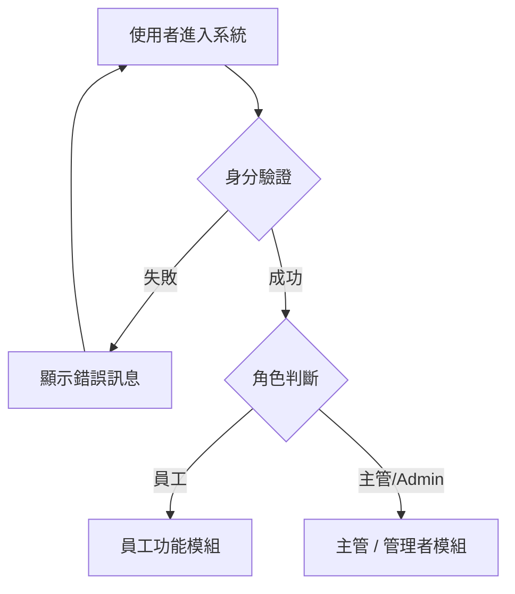
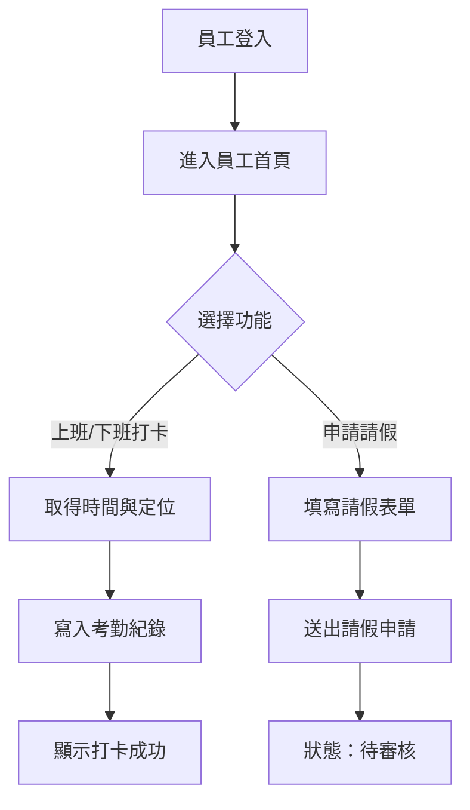
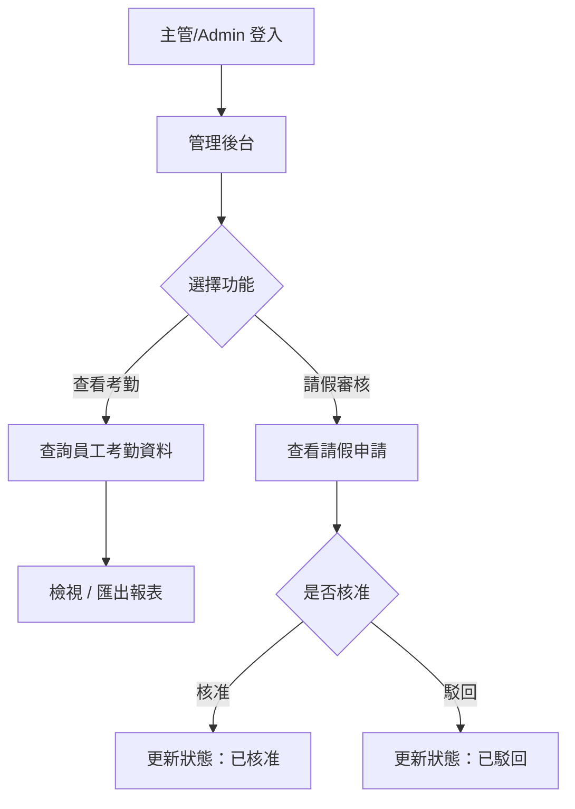
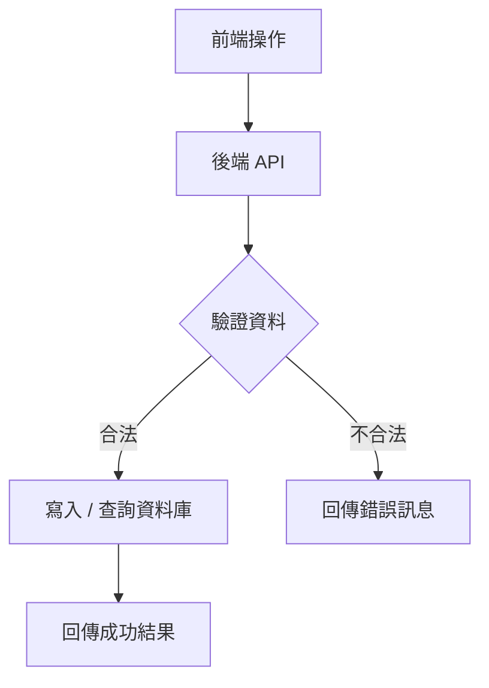

以下為「智慧化員工考勤與請假管理系統」的整體流程圖（以使用者角色區分），可直接用於簡報或報告。

---

## 一、系統整體流程（總覽）

```mermaid
flowchart TD
    A[使用者進入系統] --> B{身分驗證}
    B -->|失敗| B1[顯示錯誤訊息]
    B1 --> A
    B -->|成功| C{角色判斷}

    C -->|員工| D[員工功能模組]
    C -->|主管/Admin| E[主管 / 管理者模組]
```

---

## 二、員工端流程（打卡與請假）

```mermaid
flowchart TD
    A[員工登入] --> B[進入員工首頁]
    B --> C{選擇功能}

    C -->|上班/下班打卡| D[取得時間與定位]
    D --> E[寫入考勤紀錄]
    E --> F[顯示打卡成功]

    C -->|申請請假| G[填寫請假表單]
    G --> H[送出請假申請]
    H --> I[狀態：待審核]
```

---

## 三、主管 / Admin 流程（審核與管理）

```mermaid
flowchart TD
    A[主管/Admin 登入] --> B[管理後台]
    B --> C{選擇功能}

    C -->|查看考勤| D[查詢員工考勤資料]
    D --> E[檢視 / 匯出報表]

    C -->|請假審核| F[查看請假申請]
    F --> G{是否核准}
    G -->|核准| H[更新狀態：已核准]
    G -->|駁回| I[更新狀態：已駁回]
```

---

## 四、資料庫互動流程（邏輯層）

```mermaid
flowchart TD
    A[前端操作] --> B[後端 API]
    B --> C{驗證資料}
    C -->|合法| D[寫入 / 查詢資料庫]
    C -->|不合法| E[回傳錯誤訊息]
    D --> F[回傳成功結果]
```

---

