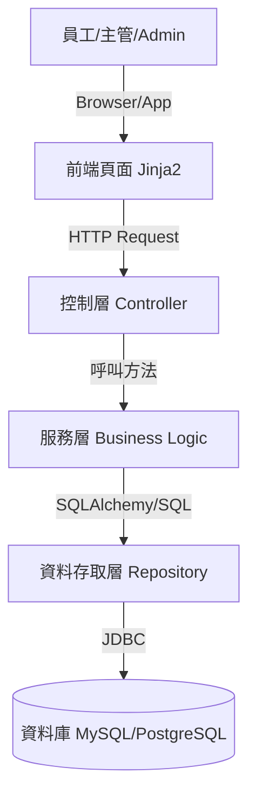
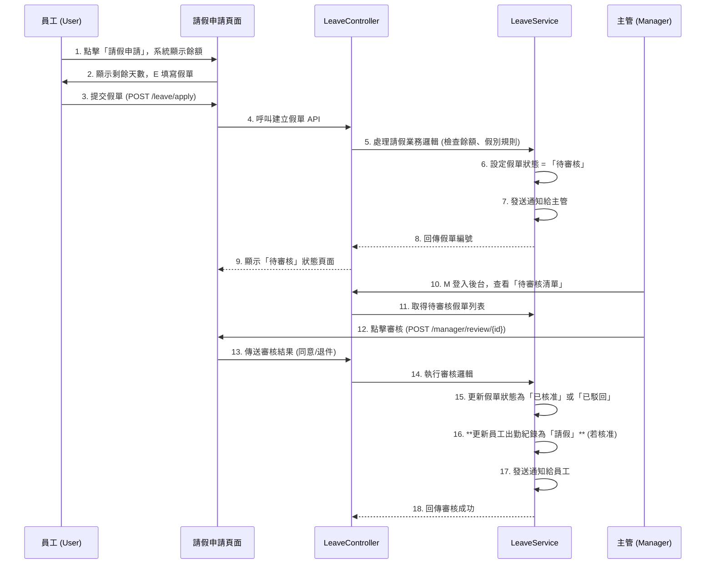

# 📘 doc/SA.md：系統架構書
## 1. 使用案例對應 (Use Case Mapping)
本架構旨在支援 REQ 文件中定義的功能需求（FR），確保系統骨架能完整覆蓋所有核心需求。由於角色已劃分為員工、主管與 Admin 三類，以下表格已更新權限對應關係。
| REQ 編號 | 使用案例 (Use Case) | 參與角色 | 對應 SA 模組/頁面 |
| :--- | :--- | :--- | :--- |
| FR-01 | 上下班打卡 | 員工 | 前台-打卡頁面、API-考勤服務 |
| FR-02 | 補打卡申請 | 員工 | 前台-補卡申請頁面、API-補卡服務 |
| FR-03 | 顯示打卡紀錄 | 員工/主管/Admin | (分權限) 前台-個人查詢; 後台-紀錄管理列表 |
| FR-04 | 請假申請 | 員工 | 前台-請假申請頁面、API-假單服務 |
| FR-05 | 請假審核 | 主管/Admin | 後台-待審核清單頁面、API-假單審核服務, |
| FR-06 | 匯出打卡紀錄 | 主管/Admin | 後台-紀錄管理列表 (匯出功能), |
| FR-07 | 出勤異常提醒 | 員工/主管/Admin | API-異常通知服務, |
| **FR-08** | **帳號管理** | **Admin** | **Admin-系統設定頁** |
| **FR-09** | **角色指派與管理** | **Admin** | **Admin-系統設定頁** |
| **FR-10** | **部門管理與人員歸屬** | **Admin** | **Admin-系統設定頁** |
## 2. 系統分層概觀 (System Layer Overview)
本系統採用標準的分層架構，以確保職責分離,。
* **前台 (WebUI)**：負責顯示資料與使用者（員工）互動，使用 Jinja2 渲染 HTML。
* **後台 (Controller/API)**：負責接收請求（考勤、請假），驗證輸入與回應結果。
* **服務層 (Service)**：負責核心業務邏輯運算，例如判斷遲到、計算工時、處理請假餘額。
* **資料層 (Repository/DB)**：負責與資料庫進行 CRUD 存取（例如 `CheckInRecord`、`LeaveRecord`）。
> **資料流向說明**：使用者操作 WebUI $\rightarrow$ 發送 HTTP 請求至 Controller $\rightarrow$ 呼叫 Service 處理邏輯 $\rightarrow$ 透過 Repository 存取 DB,。
## 3. 頁面架構列表 (Page Architecture) —— ⭐ 最重要
以下是根據員工、主管、Admin 三個獨立角色重新定義的系統頁面列表。
### 3.1 前台頁面 (Frontend Pages) - 員工視角
| 頁面名稱 (URL 建議) | 主要功能/資訊 | 關鍵按鈕/操作 |
| :--- | :--- | :--- |
| **登入頁** (`/login`) | 員工帳號密碼登入 | 登入 |
| **打卡頁面** (`/checkin`) | 顯示當日出勤狀態 | **一鍵打卡**（上班/下班）, |
| **我的出勤紀錄** (`/records`) | 顯示歷史打卡紀錄與工時統計 | 查詢、篩選（按日期）, |
| **補卡申請頁** (`/apply/manual`) | 填寫補卡原因與時間 | 提交申請、上傳照片（可選） |
| **請假申請頁** (`/leave/apply`) | 顯示**假別餘額**、請假表單（假別、起訖日、理由） | 提交申請、上傳附件, |
| **我的請假紀錄** (`/leave/records`) | 顯示每筆請假紀錄（假別、日期、狀態） | 查詢、取消或修改（如果尚未審核）, |
### 3.2 後台頁面 (Backend Pages) - 主管視角 (Manager)
主管的職責是部門層級的管理與審核,。
| 頁面名稱 (URL 建議) | 主要功能/資訊 | 關鍵按鈕/操作 |
| :--- | :--- | :--- |
| **主管登入頁** (`/manager/login`) | 登入主管帳號 | 登入 |
| **部門儀表板** (`/manager/dashboard`) | 顯示**今日部門出勤總覽**（遲到、未打卡、請假人數） | 篩選（按部門）、查看詳情 |
| **待審核清單** (`/manager/review`) | 顯示所屬部門所有待審核的補卡/請假申請 | **快速同意/退件**、快速篩選（按假別、員工） |
| **團隊請假日曆** (`/manager/leave/calendar`) | 月/週視圖顯示部門成員請假狀況、假別顏色區分 | 點擊日曆查看當日請假明細 |
| **部門紀錄列表** (`/manager/records`) | 顯示**部門**員工的歷史打卡與考勤紀錄 | **匯出部門月報表** (Excel/PDF), |
### 3.3 後台頁面 (Backend Pages) - Admin 管理視角
Admin 的職責是全系統的配置、帳號管理和全公司數據的宏觀分析,。
| 頁面名稱 (URL 建議) | 主要功能/資訊 | 關鍵按鈕/操作 |
| :--- | :--- | :--- |
| **Admin 登入頁** (`/admin/login`) | Admin 帳號密碼輸入 | 登入 |
| **全公司儀表板** (`/admin/company/dashboard`) | 顯示**全公司**出勤總覽、遲到率、加班時數 | 分部門 KPI 報表、數據可視化圖表, |
| **假別餘額總覽** (`/admin/leave/overview`) | 顯示**所有員工**各假別餘額與使用狀況 | 匯出功能 (Excel/CSV)、顯示異常警示, |
| **系統設定頁** (`/admin/settings`) | 假別類型設定、假別累計規則、代理審核設定 (FR-09, FR-10) | **權限控管**、審核流程設計,, |
| **帳號管理頁** (`/admin/users`) | 員工帳號 CRUD、角色指派（FR-08, FR-09） | 建立/停用帳號、重設密碼 |
## 4. 系統架構圖 (System Architecture Diagram)
使用 Mermaid 語法呈現高階分層結構，強調資料流向。

## 5. 使用者情境順序圖 (User Sequence Diagram)
針對 REQ 中的**情境 3：員工申請與追蹤假單** (FR-04/FR-05) 繪製業務流程圖,,。

## 6. 技術選用 (Technology Selection)
本專案選用 Python 生態系統，確保系統架構符合模組化與 RWD 設計,。
| 類別 | 選用技術 | 選擇理由與對應 SA 結構 |
| :--- | :--- | :--- |
| **主要語言** | **Python 3.10+** | 滿足專案的開發語言要求。 |
| **後端框架** | **FastAPI** | 輕量且高效能，適合建構模組化的 **API 服務**（Controller 層），滿足打卡操作 1 秒內回應的需求。 |
| **前端渲染** | **Jinja2** | 作為 Python 後端的主要模板引擎，負責將後端數據渲染成 HTML 頁面。 |
| **資料庫** | **MySQL** | 穩定且功能完整的關聯式資料庫。 |
| **資料庫存取 (ORM)** | **SQLAlchemy** (async) | 作為資料層 (Repository) 的主要工具。 |
| **環境管理** | **Docker** | 確保專案可客製化、模組化，並支援雲端與本地部署版本。 |
| **強制性開發工具** | **NotebookLM, Gemini CLI, GitHub** | 嚴格遵守專題規範。 |
| **開發環境** | **VS Code (Visual Studio Code)** | 輕量且免費，更適合 Python 初學者，取代了 PyCharm Professional。 |