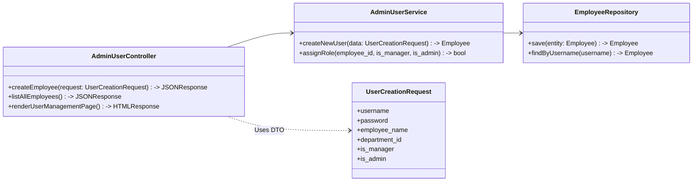
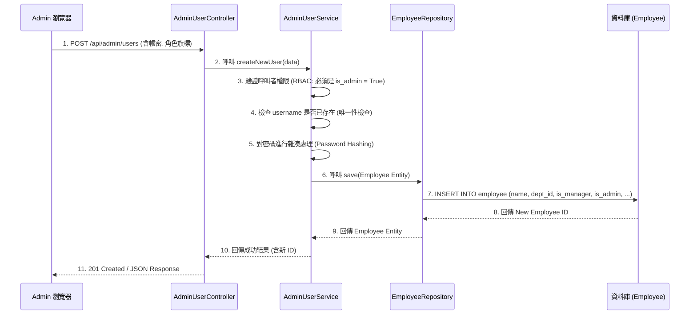
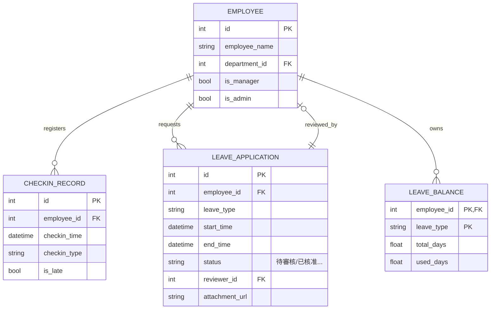

本文件是根據您的最新規格（三種獨立角色：員工、主管、Admin）以及我們確認的 **Python/FastAPI/Jinja2/MySQL** 技術棧，重新製作的《系統設計書》(SD.md)。
此設計書遵循 SD 撰寫規範，將 SA 中定義的架構骨架（分層與頁面）轉換為具體的程式實作方案，作為 Gemini CLI 生成程式碼的直接指令來源,。
---
# 📙 doc/SD.md：系統設計書 (Python/FastAPI)
## 1. 📋 SA 需求實作對應表 (Implementation Mapping)
此表格列出 SA 中定義的功能，並對應到具體的程式碼元件，確保 SD 與 SA 需求的雙向追溯。新的設計將 Admin 和 Manager 的頁面與 API 明確區分。
| SA 頁面編號 | SA 頁面/模組名稱 | 前端檔案 (View - Jinja2) | 後端 API (Controller) | 資料表 (Entity) | 實作邏輯摘要 |
| :--- | :--- | :--- | :--- | :--- | :--- |
| **P-01** | 登入頁 | `auth/login.html` | `POST /login` | `Employee` | 驗證帳密，發放 Session/Token |
| **P-02** | 打卡頁面 (FR-01) | `checkin.html` | `POST /checkin` | `CheckInRecord` | **純粹記錄時間戳記**，判斷是否遲到, |
| **P-03** | 請假申請頁 (FR-04) | `leave/apply.html` | `POST /leave/apply` | `LeaveApplication` | 顯示餘額並處理請假表單提交 |
| **M-01** | 待審核清單 (FR-05) | `manager/review.html` | `GET /api/manager/review` | `LeaveApplication` | 顯示所屬**部門**待審核單據，主管權限檢查 |
| **M-02** | 審核 API (FR-05) | (無獨立頁面) | `POST /api/manager/review/{id}` | `LeaveApplication` | 處理主管同意/退件邏輯，更新出勤紀錄 |
| **M-03** | 部門紀錄列表 (FR-06) | `manager/records.html` | `GET /api/manager/records` | `CheckInRecord` | 查詢**部門**員工紀錄並支援匯出 |
| **A-01** | **帳號管理頁 (FR-08, FR-09)** | `admin/users.html` | `GET/POST /api/admin/users` | `Employee` | Admin 專用：帳號 CRUD 與角色指派 |
| **A-02** | **系統設定頁 (FR-10)** | `admin/settings.html` | `POST /api/admin/settings` | `Department` | Admin 專用：部門與主管歸屬設定, |
| **A-03** | 假別餘額總覽 | `admin/leave/overview.html` | `GET /api/admin/leave/overview` | `LeaveBalance` | Admin 專用：**全公司**餘額查詢與異常警示 |
---
## 2. 🧩 模組詳細實作規格 (Module Realization Specs)
我們針對核心管理功能 **A-01 帳號管理與角色指派 (FR-08, FR-09)** 進行詳細設計。
### A. 相關類別與方法 (Class Design)
此設計遵循 Python/FastAPI 的架構，專注於 Admin 級別的資料管理。

### B. 詳細 API 規格 (Detailed API)
* **Endpoint**: `POST /api/admin/users`
* **用途**: Admin 建立新員工帳號，並在建立時指派其角色 (FR-09)。
* **Input (Request Body - JSON)**:
| 欄位名稱 | 型態 | 說明 | 備註 |
| :--- | :--- | :--- | :--- |
| `username` | `VARCHAR` | 員工登入帳號 | 唯一值 |
| `password` | `VARCHAR` | 初始密碼 | 需雜湊儲存 |
| `employee_name` | `VARCHAR` | 員工姓名 | |
| `department_id` | `INT` | 歸屬部門 ID | 外鍵 (FK) |
| `is_manager` | `BOOLEAN` | 是否具備主管權限 | 決定能否審核 M-01 |
| `is_admin` | `BOOLEAN` | 是否具備系統管理員權限 | 決定能否訪問 A-01, A-02 |
* **Output (Response - JSON)**:
| 欄位名稱 | 型態 | 說明 |
| :--- | :--- | :--- |
| `status` | `STRING` | "SUCCESS" 或 "FAILURE" |
| `employee_id` | `INT` | 新建立員工的 ID |
| `message` | `STRING` | 帳號建立成功提示 |
### C. 實作邏輯步驟 (Implementation Logic - Admin 建立帳號 FR-08/FR-09)
此流程描述 Admin 創建一個新員工帳號並賦予權限的詳細後端步驟,。

---
## 3. 🗄️ 資料庫詳細設計 (Detailed Schema)
定義核心資料表結構。為支援三個角色分權，`Employee` 資料表結構已更新，增加了 `is_admin` 欄位。
### A. 資料表結構
| 資料表 (Entity) | 欄位名稱 | 資料型態 | 主鍵/外鍵 | 是否允許 Null | 說明 |
| :--- | :--- | :--- | :--- | :--- | :--- |
| **Employee** | `id` | `INT` | PK | 否 | 員工 ID |
| | `employee_name` | `VARCHAR(100)` | | 否 | 員工姓名 |
| | `department_id` | `INT` | FK | 否 | 部門 ID (FR-10) |
| | **`is_manager`** | **`BOOLEAN`** | | **否** | **是否為主管** (用於審核 M 權限) |
| | **`is_admin`** | **`BOOLEAN`** | | **否** | **是否為 Admin** (用於系統配置 A 權限) |
| **CheckInRecord** | `id` | `INT` | PK | 否 | 打卡記錄 ID |
| | `employee_id` | `INT` | FK | 否 | 關聯員工 |
| | `checkin_time` | `DATETIME` | | 否 | 精確打卡時間戳記 |
| | `checkin_type` | `VARCHAR(10)` | | 否 | 上班/下班/補卡 |
| | `is_late` | `BOOLEAN` | | 否 | 是否遲到 (由 Service 計算) |
| **LeaveApplication** | `id` | `INT` | PK | 否 | 假單 ID |
| | `employee_id` | `INT` | FK | 否 | 申請員工 |
| | `reviewer_id` | `INT` | FK | 是 | 審核主管 ID |
| | `status` | `VARCHAR(10)` | | 否 | 待審核/已核准/已駁回 |
| **LeaveBalance** | `employee_id` | `INT` | PK, FK | 否 | 關聯員工 (複合主鍵) |
| | `leave_type` | `VARCHAR(20)` | PK | 否 | 假別 |
| | `total_days` | `FLOAT` | | 否 | 總天數 |
### B. 資料庫 ERD (實體關係圖)

---